# Harmshelf

Audiobookshelf的鸿蒙原生客户端，适配手机、平板、PC/2in1。

## 应用截图

### 手机

  
  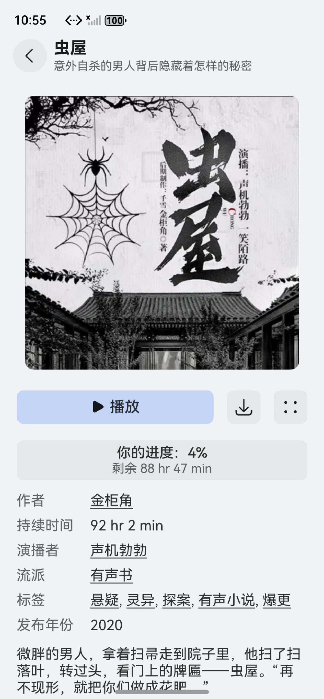
  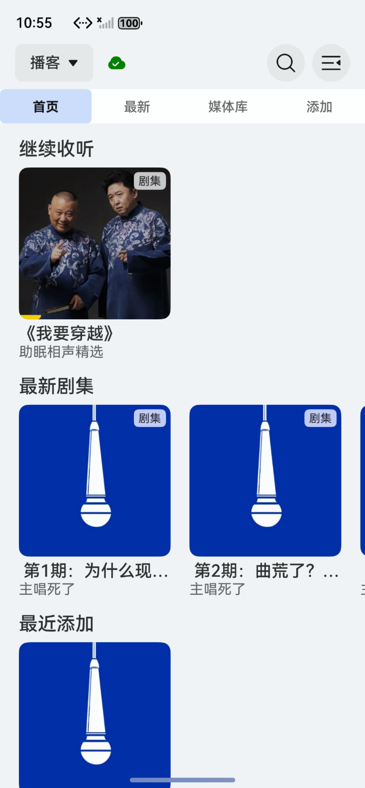
  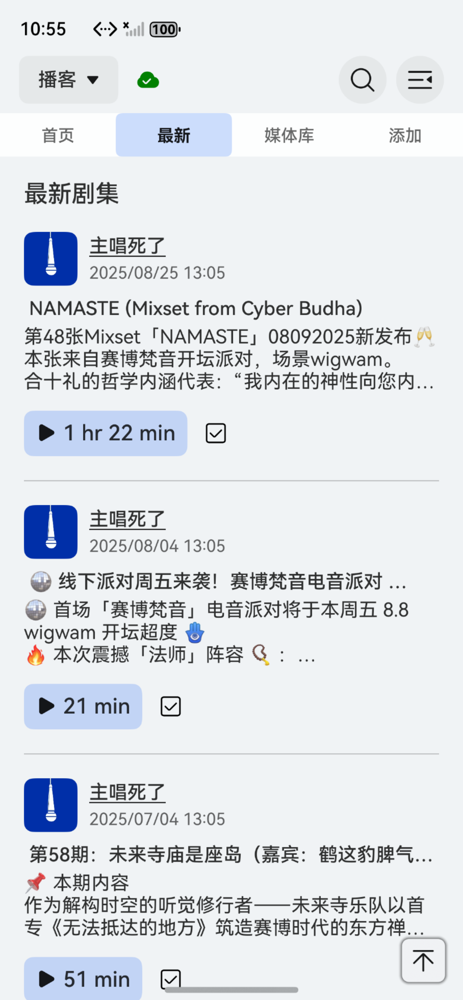
  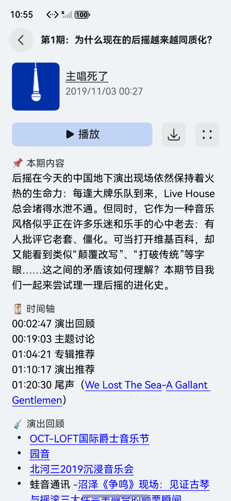
  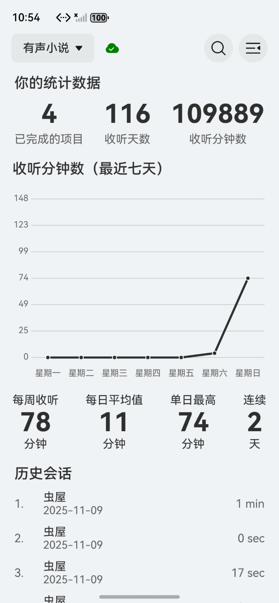

### 平板/折叠屏/PC

  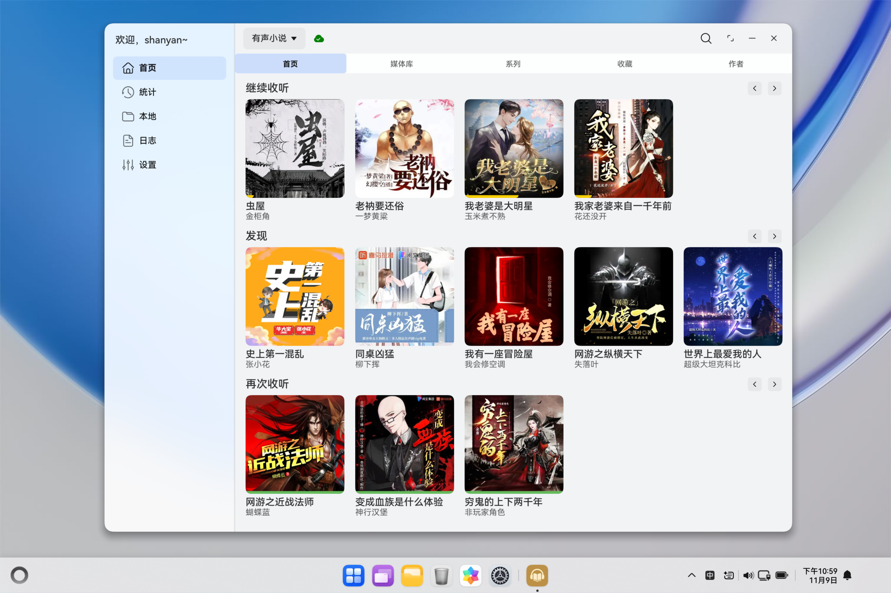
  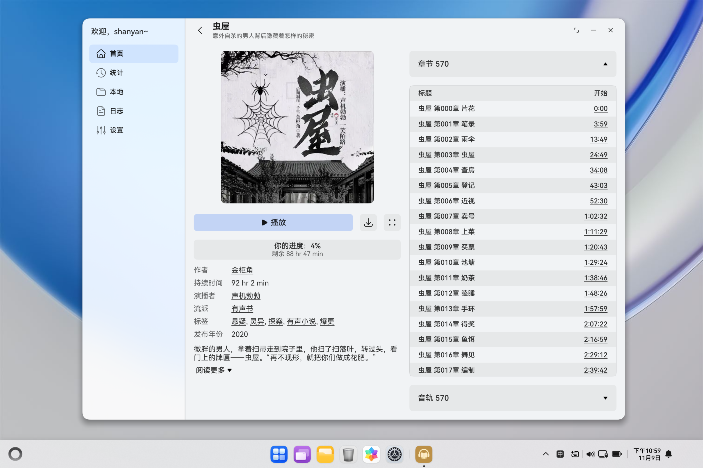
  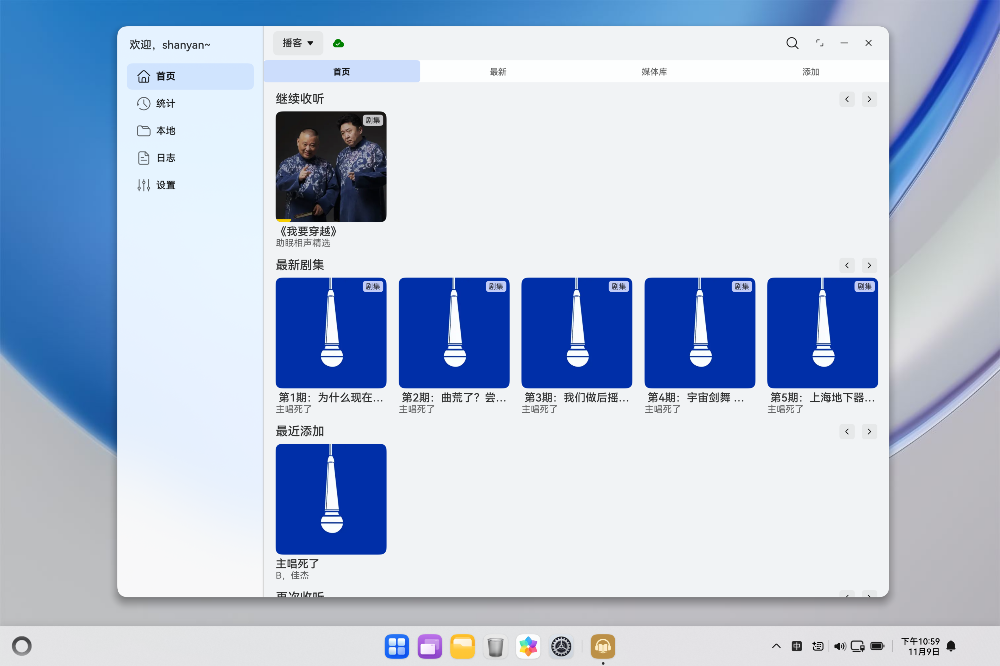
  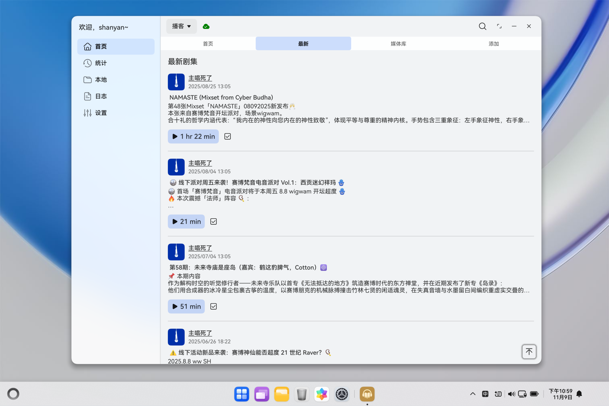
  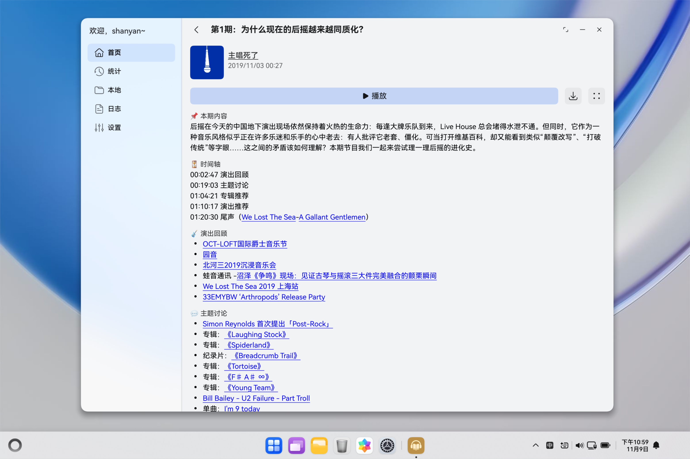
  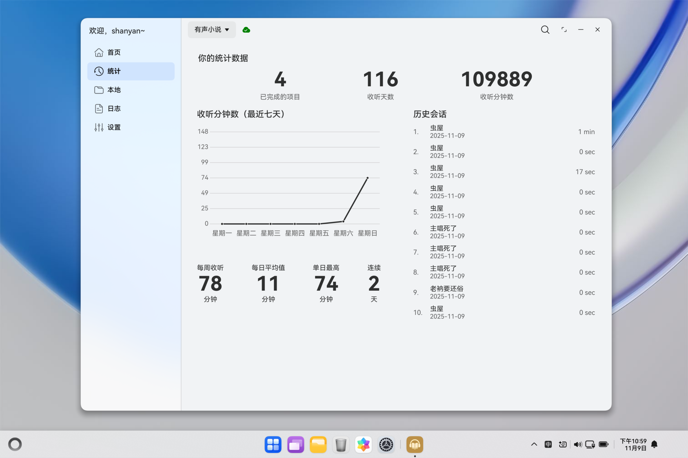

## 安装方式

### 邀请测试

将以下链接复制到华为浏览器打开：

https://appgallery.huawei.com/link/invite-test-wap?taskId=336af871deef169cfbdacf59b901b766&invitationCode=97yFZtvRXuL

### 自行侧载

推荐使用[auto-installer](https://github.com/likuai2010/auto-installer)进行安装。
